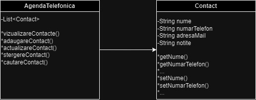

# Titlu proiect
Agendă telefonică

### Student(i)
Bădescu Radu

## Descriere
Aplicatia reprezinta o agenda telefonica care permite stocarea si gestionarea contactelor. Aplicatia ofera utilizatorului posibilitatea sa adauge, sa stearga sau sa actualizeze contacte telefonice. Contactele salveaza pe langa numarul de telefon si informatii precum nume, adresa de e-mail sau chiar notite despre contactul respectiv. Utilizatorul aplicatiei poate efectua cautari in lista de contacte dupa criterii precum nume sau numar de telefon si poate vizualiza detaliile aferente acestuia.

## Obiective

* Dezvoltarea unei interfete usor de utilizat pentru a crea o atmosfera cat mai prietenoasa pentru utilizatorul obisnuit.
* Operatiile sa fie implementate eficient astfel incat aplicatia sa ruleze bine pe orice sistem.

## Arhitectura

## Functionalitati/Exemple utilizare
* Adaugarea unui Contact - Utilizatorul poate adauga un contact in agenda, salvand informatii despre acesta precum numar de telefon, nume, e-mail etc.
* Stergerea unui Contact - Utilizatorul poate sterge un contact din agenda.
* Actualizarea unui Contact - Utilizatorul poate actualiza datele despre un contact deja existent.
* Cautarea unui Contact - Utilizatorul poate cauta un contact in agenda dupa nume sau numarul de telefon.

### Resurse
Markdown Guide, [Online] Available: https://www.markdownguide.org/basic-syntax/ [accesed: Mar 14, 1706]
